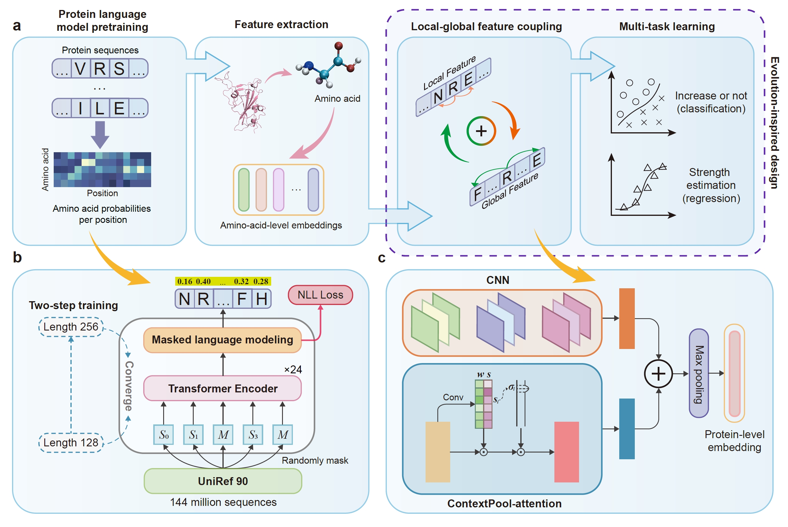
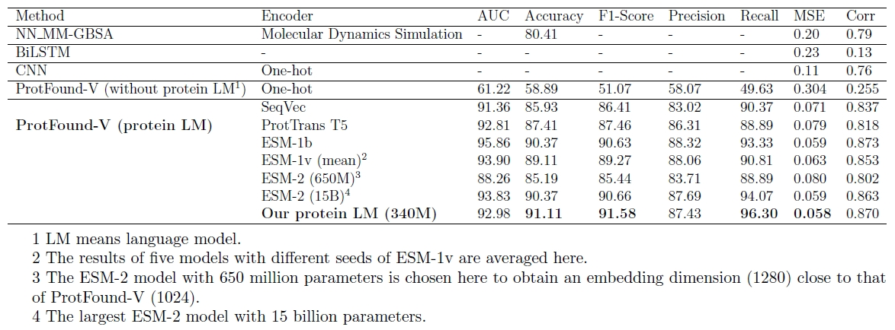
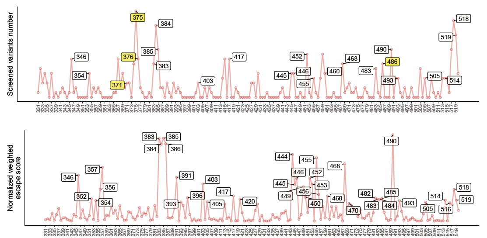

# ProtFound-V

The official code repository of "Evolution-guided large language model is a predictor of virus mutation trends".

- [Overview](#overview)
- [System Requirements](#system-requirements)
- [Installation Guide](#installation-guide)
- [Repo contents](#repo-contents)
- [Demo and Instructions for Use](#demo-and-instructions-for-use)
- [License](#license)

# Overview

We introduce ProtFound-V, an evolution-inspired deep-learning framework designed to explore the mutational trajectory of virus. ProtFound-V accurately identifies the evolutionary advantage of Omicron and proposes evolutionary trends consistent with wet-lab experiments through *in silico* deep mutational scanning. With the evolution-guided large language model, ProtFound-V presents a new state-of-the-art performance in key property predictions. Despite the challenge posed by epistasis to model generalization, ProtFound-V remains robust when extrapolating to lineages with different genetic backgrounds. Overall, this work paves the way for rapid responses to emerging viral infections, allowing for a plug-and-play approach to understanding and predicting virus evolution.



# System Requirements

## Hardware requirements

The backbone pretraining and the protein feature extraction (inference on backbone) are conducted on **Ascend-910 (32GB)**.

**!! NOTE: The Ascend NPU environment is only for protein feature extraction. We provide the extracted features of the sequences used for experiments below. You can use the extracted results directly for downstream applications.**

The downstream predictions using extracted features can be conducted on a standard computer with NVIDIA GPU with no less than 8G memory and enough RAM to run training and inference. The downstream experiments are conducted on one Tesla V100 (32GB).

## Software requirements

### OS Requirements

The backbone pretraining and protein feature extraction (inference on backbone) are conducted on CentOS. **This is not necessary for downstream training and predicting.**

The downstream experiments are conducted on Ubuntu 16.04.1.

### Python Dependencies

For the backbone pretraining and protein feature extraction (inference on backbone), the required python environments are as follows.

**!! NOTE: This environment is only for protein feature extraction. We provide the extracted features of the sequences used for experiments below. You can use the extracted results directly for downstream applications.**

```
python==3.8
numpy>=1.21
mindspore==2.0.1
moxing
scipy
```

For the downstream experiments, the required python environments are as follows.

```
python==3.7.13
numpy>=1.21
torch==1.11.0
scikit-learn>=1.0.2
matplotlib>=3.5.1
transformers>=4.30.2
```

# Installation Guide

## Instructions

### Setting up downstream environment

Create a new environment.

```shell
conda create -n protfound python=3.7
conda activate protfound
```

Install pytorch 1.11.0.

```python
pip install torch==1.11.0+cu113 torchvision==0.12.0+cu113 torchaudio==0.11.0 --extra-index-url https://download.pytorch.org/whl/cu113
```

Install other dependencies.

```shell
pip install -r requirements.txt
```

It takes less than 10 minutes to install python dependencies for downstream experiments on a standard computer.


# Repo contents

```shell
- demo_bind/
	- bind_train_5fold.py # quick start for binding affinity training
	- bind_predict_5fold.py # quick start for binding affinity predicting
- bind_training_and_testing/
	- bind_train_5fold.py # Cross-validation code on single mutation dataset
	- bind_test_5fold.py # Prediction code on blind test set
	- get_random_test.py # split training and testing set
- attributes_train_and_predict/
	- training/
		- bind_train/
			- cross_validation/
				- bind_train_5fold.py # Cross-validation code
				- bind_test_5fold.py # Prediction code on blind test set
			- bind_train_all.py # Overall training code for bind
			- statistic.py # Calculate the mean and std of training feature
		- expression_train/
			- cross_validation/
				- expr_train_5fold.py # Cross-validation code
				- expr_test_5fold.py # Prediction code on blind test set
			- expr_train_all.py # Overall training code for expression
			- statistic.py # Calculate the mean and std of training feature
		- escape_train/
			- split_origin_dataset.py # Split the original dataset into 11 files
			- create_data.py # Create training data
			- escape_train_all.py # Overall training code for escape
		- data_process_bind_expr.py # Data process of bind and expression data
	- predicting/
		- predict_bind_emb_main_pickle.py # use the pretrained model to predict binding affinity
		- predict_expr_emb_main_pickle.py # use the pretrained model to predict expression
		- predict_escape_emb_main_pickle.py # use the pretrained model to predict antibody escape
- pretraining/ # codes for backbone pretraining and feature extracting
	- src/
		- bert_model.py # bert model architecture
		- bert_for_pre_training.py # bert pretraining architecture
		- dataset.py # dataset loader
		- ... # other src
		- model_utils/
			- device_adapter.py # adapter for distributed training
			- ... # other utils
	- run_pretrain.py # bert pretraining main
	- pretrain_config.yaml # training config
	- extract_embedding_local.py # feature extracting code for local device
```


# Demo and Instructions for Use

## Quick start

We provide a quick demo for the binding affinity prediction experiment to show the learning and predicting ability of ProtFound-V. The dataset used here is single-site mutation benchmark.

- Training

Download the extracted sequence feature of the training and testing data.

```shell
cd demo_bind/data
wget https://zenodo.org/records/10039065/files/QuickStart.tar.gz
tar -zxvf QuickStart.tar.gz
cd ..
```

Run `bind_train_5fold.py` to do 5 fold cross validation using training data.

```shell
python bind_train_5fold.py > train_output.txt 2>&1
```

[](https://colab.research.google.com/github/ZhiweiNiepku/ProtFound-V/blob/main/examples/ProtFound_V_QuickStart_train.ipynb)

- Testing

Use training result to predict the binding affinity of the blind test set. Besides, we provide our training checkpoints to make a quick prediction. 

```shell
# run prediction
python bind_predict_5fold.py > test_result.txt 2>&1
```

[](https://colab.research.google.com/github/ZhiweiNiepku/ProtFound-V/blob/main/examples/ProtFound_V_QuickStart_predict.ipynb)

The expected outputs are as follows.

| AU-ROC   | Acc   | F1-Score | Precision | Recall | MSE   | Corr  |
| ----- | ----- | -------- | --------- | ------ | ----- | ----- |
| 92.98 | 91.11 | 91.58    | 87.43     | 96.30  | 0.058 | 0.870 |

It takes only several hours to train on training data, and several seconds to predict on test data.

## Protein sequence feature extraction

**!! NOTE: We provide the extracted features of the sequences used for experiments at the end of this section. You can use the extracted results directly for downstream applications and skip this section.**

Use our pretrained backbone to extract feature embeddings of protein sequences for downstream application. The pretrained checkpoint can be downloaded in the table below.

Use `pretraining/extract_embedding_local.py` to extract feature embeddings on your computer or server. Please modify the file path in the code before executing.

```python
    ms.context.set_context(variable_memory_max_size="30GB")
    ckpt_path = '<path to the pretrained model>/checkpoint.ckpt'

    data_path = '<path to the dir to extract features>/raw/'
    filelist = glob.glob(data_path+"*.txt")
    filelist.sort()
    result_path = "<path to the dir to save results>/result/"
    os.makedirs(result_path, exist_ok=True)
```

We provide the extracted protein features as well as the pretrained checkpoints here for the convenient experiments on downstream tasks.

[](https://zenodo.org/doi/10.5281/zenodo.10038909)

| Section                                  | Download Link                                                | Content                                                      |
| ---------------------------------------- | ------------------------------------------------------------ | ------------------------------------------------------------ |
| **Pretrained checkpoint**                | [](https://zenodo.org/records/10043360/files/checkpoint_protfound_v.ckpt) | Our pretrained checkpoint.                                    |
| **QuickStart**                           | [](https://zenodo.org/records/10043360/files/QuickStart.tar.gz) | Extracted features and trained checkpoints.                  |
| **Single-site mutation benchmark**       | [](https://zenodo.org/records/10043360/files/Single-site_mutation_benchmark.tar.gz) | Raw RBD sequences and extracted features.                    |
| **Multi-site mutation benchmark**        | [](https://zenodo.org/records/10043360/files/Multi-site_mutation_benchmark.tar.gz) | Raw RBD sequences and extracted features.                    |
| **Determining high-risk mutation sites** | [](https://zenodo.org/records/10043360/files/Determining_high-risk_mutation_sites.tar.gz) | Raw protein sequences, extracted features, and trained checkpoints. |


## Binding affinity training and predicting

We use the single-site mutation benchmark and multi-site mutation benchmark to do model training and testing to show the learning and predicting power of ProtFound-V.

- Data process

Use pretrained backbone to extract protein sequence features, or download the extracted results from the table above.

- Training

Training script is `bind_training_and_testing/bind_train_5fold.py`. Modify the file paths in the code.

```python
# load data
feats=np.load('<path to embedding data>')
reg_label=np.load('<path to label>').reshape(-1,1)
```

Run the script to do training.

```shell
python bind_train_5fold.py > output_bind_train.txt 2>&1
```

- Testing

Testing script is `bind_training_and_testing/bind_test_5fold.py`. Modify the file paths in the code.

```python
model_dir="<your training result dir>/model_{}.pth.tar"
model = SoluModel(SEQ_LEN)
model = model.to(device)

# load train data
train_feats=np.load('<path to embedding data>/4KwPtest_train_85_embedding_data.npy')
scaler=StandardScaler()
shape_=train_feats.shape
train_feats=train_feats.reshape(shape_[0],-1)
scaler.fit(train_feats)
del train_feats

# load test data
test_feats=np.load('<path to embedding data>/pnas_test_85_embedding_data.npy')
test_reg_label=np.load('<path to label>/pnas_test_85_embedding_label.npy')
test_cls_label=(test_reg_label>1)
shape_=test_feats.shape
test_feats=test_feats.reshape(shape_[0],-1)
test_feats=scaler.transform(test_feats).reshape(shape_)
```

Run the script to do testing.

```shell
python bind_test_5fold.py > output_bind_test.txt 2>&1
```

ProtFound-V can achieve state-of-the-art performance in single-site mutation benchmark and multi-site mutation benchmark.



## Determining high-risk mutation sites

We use ProtFound-V to predict the binding affinity with ACE2, expression and antibody escape induced by each single-site mutation, and comprehensively consider these properties to determine high-risk mutation sites.

### Data Process

- Binding affinity data and expression data

We use the dataset from *Deep mutational scans for ACE2 binding, RBD expression, and antibody escape in the SARS-CoV-2 Omicron BA.1 and BA.2 receptor binding domains*. Use pretrained backbone to extract protein sequence features, or download the extracted results from the table above.

Run the following script (`attributes_train_and_predict/training/data_process_bind_expr.py`) to do sequence filtering and to split training and testing sets.

```shell
cd attributes_train_and_predict/training
python data_process_bind_expr.py
```

- Antibody escape data

We use the dataset from *Imprinted SARS-CoV-2 humoral immunity induces convergent Omicron RBD evolution*. We split the dataset into 11 csvs due to the memory limit, including 10 csvs for training and 1 for validation.

Use pretrained backbone to extract protein sequence features, or download the extracted results from the table above.

Run `attributes_train_and_predict/training/escape_train/split_origin_dataset.py` to split all the sequences into training and validating sets.

```shell
python split_origin_dataset.py
```

Run `attributes_train_and_predict/training/escape_train/create_data.py` to get features for each sequence in training and validating sets.

```shell
python create_data.py
```

### Binding affinity and expression

The training and testing process of binding affinity and expression are the same. Take binding affinity as example.

- Training

We first conduct 5-fold cross validation to determine model hyperparameters.

```shell
cd attributes_train_and_predict/training/bind_train/cross_validation
# 5 fold training
python bind_train_5fold.py > output_train_5fold.txt 2>&1
# 5 fold testing
python bind_test_5fold.py > output_test_5fold.txt 2>&1
```

Use all the data to do model training with the best model hyperparameters.

```shell
cd attributes_train_and_predict/training/bind_train
python bind_train_all.py > output_train_all.txt 2>&1
```

- Predicting

Calculate the statistical data of training features for test feature normalization.

```shell
cd attributes_train_and_predict/training/bind_train
python statistic.py
```

Run the predicting script to do binding affinity prediction. Here we use `.pickle` file as an example to illustrate how to load testing data. Other data formats, such as `.npy`, `.h5`, can also be loaded by adjusting loading code.

```shell
cd attributes_train_and_predict/predicting
python predict_bind_emb_main_pickle.py
```

The predicted results are saved in `.npy` format.

### Antibody escape

- Training

Use training data and validating data to do model training. We didn't conduct cross validation here due to the memory limit.

```shell
cd attributes_train_and_predict/training/escape_train
python escape_train_all.py
```

- Predicting

Calculate the statistical data of training features for test feature normalization, and run the predicting script to do prediction.

```shell
cd attributes_train_and_predict/predicting
python predict_escape_emb_main_pickle.py
```

The predicted results are saved in `.npy` format.

All the predicted results are integrated in `drawing/site_predict/create_draw_predict_data.py` to filter the high-risk sites, which is further discussed in [Figure reproduction](#Figure reproduction).

## Figure reproduction

Codes for reproducing figures.

- Dimension reduction visualization

We do dimension reduction to the feature before the feature coupling and the feature after feature coupling to show that the feature coupling moudule learns how to separate positive and negative samples.

```shell
cd drawing/pca_visualize
python cluster.py
```

- High-risk sites prediction

Some of the drawing scripts are from [SARS-CoV-2-reinfection-DMS](https://github.com/jianfcpku/SARS-CoV-2-reinfection-DMS). Thanks for their great work!

1. To draw target curves, run `drawing/site_predict/calculate_preference_target.ipynb` or `calculation/calculate_preference.ipynb` in [SARS-CoV-2-reinfection-DMS](https://github.com/jianfcpku/SARS-CoV-2-reinfection-DMS) to generate tmp files, and run `drawing/site_predict/draw_target.r` to generate predicting target.

2. To draw predicted curves, run `drawing/site_predict/create_draw_predict_data.py` to integrate all the predicted results to filter high-risk mutation sites, and run `drawing/site_predict/draw_predict.r` to generate predicting result.

Here is an example of the comparison between the statistical evolutionary trends and the predicted evolution trends of Omicron BA.5.



# License

This project is covered under the **Apache 2.0 License**.
